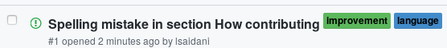

# CONTRIBUTING

This contributing guide is used by multiple projects, you can refer it if you want.

## How contributing

There are different ways to contribute to any **saidani** project. The easy way is to create an issue. To do this, follow these steps :

1. Go to project
1. Go to Issues section

    

1. Click on **New issue**

    

By default, you don't have the permission to add labels to issue, in this case add a text to title containing the desired labels using format **[label1|label2]**. For example **Spelling mistake in section How contributing [language|improvement]**. The maintainer (or anyone with permissions) can modify the title by deleting the extra text and adding desired labels. The issue will be like this

If you have enough skills, you can modify current content or add new. If you want your modifications merged with current content you must send a [pull request](https://help.github.com/en/articles/about-pull-requests)

See section [Advanced contributions](#Advanced-contributions) for more details.

## Advanced contributions

Before contributing, you must [fork](https://help.github.com/en/articles/fork-a-repo) the origin project. To keep the forked project synchronized with the origin, create [new branch](https://help.github.com/en/articles/creating-and-deleting-branches-within-your-repository) from master. Your modification will be pushed in this new branch.

Once your are satisfied with your modifications, synchronize the master branch with the origin project, create another new branch from master which will contains the merge result between the master and your contribution branch. Create new pull request to merge your contribution in the last created branch. Resolve the conflicts if they exists and send a pull request to origin.

Once the pull request is received in origin project pull requests, it will be processed by the maintainer. The first step in merging is to write some quick previews directly using changes log

.

If maintainer think that seems *OK*, a temporary branch will be created using pull request id (the pull request will be closed). This new branch will be named **draft**-{id}, where *id* is the request id. For example, this request

has *3* as id and the temporary branch will be named **draft-3**. An issue with label

will be created. It will refer to closed pull request and draft branch.
After discussions and probability helped by GitHub [reaction feature](https://github.blog/2016-03-10-add-reactions-to-pull-requests-issues-and-comments), the maintainer can push the modification to the master branch.

To edit a file or add new content in your forked project, you can use integrated GitHub editor.
It's possible to use Visual Studio Code editor, see [Contributing using VSCode](content/CONTRIBUTING-VSCode.md) for more details.

## License

This project is under [**CREATIVE COMMONS LICENSE**](LICENSE.txt).
