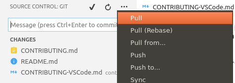

# Contributing using Visual Studio Code (VSCode)

## Tools

First install theses tools :

- [Git client](https://git-scm.com/download).
- [VSCode](https://code.visualstudio.com/Download).
- Theses VSCode plugins :
  - [markdownlint](https://marketplace.visualstudio.com/items?itemName=DavidAnson.vscode-markdownlint).
  - [Code Spell Checker](https://marketplace.visualstudio.com/items?itemName=streetsidesoftware.code-spell-checker).
  - [docs-markdown](https://marketplace.visualstudio.com/items?itemName=docsmsft.docs-markdown).
  - [Markdown All in One](https://marketplace.visualstudio.com/items?itemName=yzhang.markdown-all-in-one).
  - [GitLens](https://marketplace.visualstudio.com/items?itemName=eamodio.gitlens).

## How contributing

One the origin project forked and a contribution branch created from master, execute this command line in a specific folder (use `cd` command)

```console
git clone path/to/forked/project -b contribution_branch_name
```

For example

```console
git clone https://github.com/user_name/top -b contribution
```

Before any modification keep your local clone synchronized with upstream repository (your fork) by pulling your branch using **pull** sub-menu of **git** menu




Use `Alt+M` shortcut to insert some Markdown blocs, keep your code clean using *markdownlint* VSCode plugin.

After modifications et if you are satisfied with your contribution, push it to upstream using **push** sub-menu


You will be invited to specify your GitHub login and password. You can use git cache to store temporary your credential by executing this command in your local project folder

```console
git config credential.helper 'cache --timeout 604800'
```

**604800** is 7 days expressed in seconds.
